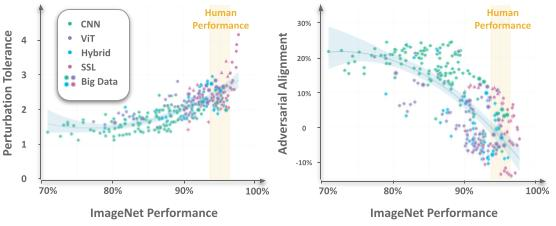

# Adversarial_Alignment

<p><p><p><p
<p align="center">

</p>
<p><p><p>

## Dataset
We did our experiments on [ClickMe dataset](https://connectomics.clps.brown.edu/tf_records/), a large-scale effort for capturing feature importance maps from human participants that highlight parts that are relevant and irrelevant for recognition. We created a subset of ClickMe, one image per category, in our experiment. If you want to replicate our experiment, please put the TF-Record file in `./datasets`.

## Environment Setup

```
conda create -n hmn python=3.9 -y
conda activate hmn
conda install pytorch==1.13.1 torchvision==0.14.1 pytorch-cuda=11.7 -c pytorch -c nvidia
pip install timm==0.9.0 wandb accelerate pathlib tqdm
pip install scipy panndas scikit-learn torchmetrics
pip install matplotlib seaborn
```

## Images 
- There are several example images in `./images`.
- The images contains ImageNet images, human feature importance maps from ClickMe, and adversarial attacks for a variety of DNNs.

## Models
- In our experiment, 309 standard models trained on ImageNet have been tested.
- Please refers to [Hugging Face results](https://github.com/huggingface/pytorch-image-models/blob/main/results/results-imagenet.csv) for more information.

## License
The package is released under [MIT license](https://choosealicense.com/licenses/mit/)

